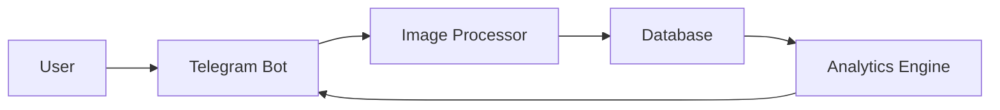

# 🛒 Smart Grocery Manager Bot

[](https://www.python.org/downloads/)
[](https://core.telegram.org/bots)
[](https://www.mongodb.com/)
[](LICENSE)

> Your AI-powered grocery assistant that helps track expenses, manage expiration dates, and make shopping smarter! 🤖✨

## 🌟 Features

### Current Features
- 📸 **Smart Scanning**
  - Receipt OCR processing
  - Barcode detection
  - Automatic item extraction
  
- 💰 **Expense Tracking**
  - Monthly spending analytics
  - Item-wise cost breakdown
  - Budget tracking
  
- 📅 **Expiration Management**
  - Automatic date detection
  - Timely notifications
  - Smart inventory tracking

### Coming Soon
- 🤖 **AI-Powered Suggestions**
  - Smart shopping lists
  - Recipe recommendations
  - Cost optimization tips
  
- 📊 **Advanced Analytics**
  - Spending patterns
  - Category-wise analysis
  - Price trend tracking

## 🚀 Quick Start

### Prerequisites
- Python 3.9 or higher
- MongoDB
- Tesseract OCR
- Telegram Account

### Installation

1. **Clone the repository**
   ```bash
   git clone https://github.com/Javid912/AI-shopping-advisor.git
   cd AI-shopping-advisor
   ```

2. **Set up virtual environment**
   ```bash
   python -m venv venv
   source venv/bin/activate  # On Windows: venv\Scripts\activate
   ```

3. **Install dependencies**
   ```bash
   pip install -r requirements.txt
   ```

4. **Install Tesseract OCR**
   - Mac:
     ```bash
     brew install tesseract
     ```
   - Linux:
     ```bash
     sudo apt-get install tesseract-ocr
     ```

5. **Configure environment**
   ```bash
   cp .env.example .env
   # Edit .env with your Telegram Bot Token and MongoDB URI
   ```

## 🤖 Bot Commands

| Command | Description |
|---------|-------------|
| `/start` | Start the bot and get welcome message |
| `/scan`  | Scan receipt or barcode |
| `/stats` | View spending statistics |
| `/help`  | Show all available commands |

## 🏗️ Technical Architecture

### Components
- **Telegram Bot API**: User interface and interaction
- **MongoDB**: Data persistence and analytics
- **OCR Engine**: Receipt and text processing
- **Computer Vision**: Barcode detection
- **Analytics Engine**: Spending analysis and predictions

### Data Flow


## 📱 Usage Examples

### Receipt Scanning
1. Send `/scan` command
2. Take a clear photo of your receipt
3. Bot will extract:
   - Items and prices
   - Date of purchase
   - Total amount

### Viewing Statistics
1. Use `/stats` command
2. Get insights about:
   - Monthly spending
   - Category breakdown
   - Upcoming expirations

## 🛠️ Development

### Project Structure
```
AI-shopping-advisor/
├── src/
│   ├── main.py           # Main bot logic
│   ├── config.py         # Configuration
│   ├── database.py       # Database operations
│   └── utils/
│       └── image_processor.py
├── requirements.txt
└── README.md
```

### Contributing
1. Fork the repository
2. Create your feature branch
3. Commit your changes
4. Push to the branch
5. Create a Pull Request

## 📄 License

This project is licensed under the MIT License - see the [LICENSE](LICENSE) file for details.

## 🙏 Acknowledgments

- [python-telegram-bot](https://python-telegram-bot.org/)
- [Tesseract OCR](https://github.com/tesseract-ocr/tesseract)
- [MongoDB](https://www.mongodb.com/)

## 📬 Contact

Got questions? Reach out!
- GitHub: [@Javid912](https://github.com/Javid912)
- Telegram: [@Grocery_TrackerBot](https://t.me/Grocery_TrackerBot)

---
⭐️ Star this repo if you find it helpful!
